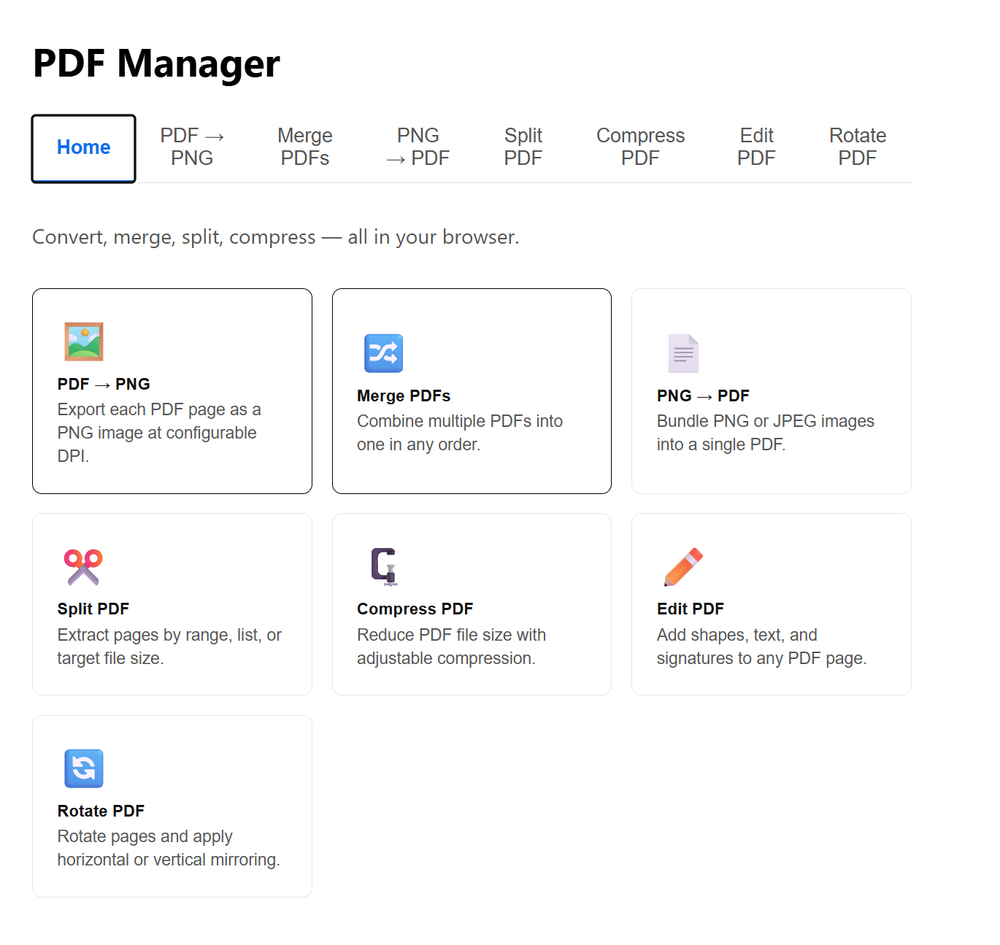

# PDF Manager

> A local web app for converting, merging, splitting, compressing, rotating, and annotating PDFs.




---

## Features

- **PDF → PNG** — Convert each page of a PDF to a PNG image at a configurable DPI (72–600). Runs entirely in-browser or via the server. Downloads a ZIP per file, or convert all at once into a single ZIP.
- **Merge PDFs** — Drop in multiple PDFs, drag them into the order you want, then merge into a single file.
- **PNG → PDF** — Pack one or more PNG images into a single PDF document.
- **Split PDF** — Extract pages by range, individual page list, or target file size. Downloads results as a ZIP.
- **Compress PDF** — Reduce PDF file size with selectable compression levels, powered by Ghostscript.
- **Rotate & Mirror PDF** — Rotate pages by 90°/180°/270° and mirror them horizontally or vertically, per-page or all at once. Downloads the transformed PDF.
- **Edit PDF** — Annotate pages with freehand drawing, text, and shapes using a Fabric.js canvas overlay. Add signatures (draw, type, or upload). Export a flattened PDF with annotations baked in.

---

## Prerequisites

- **Node.js 18+**
- **Ghostscript** — required for the Compress PDF feature

  | OS      | Install command                                      |
  |---------|------------------------------------------------------|
  | macOS   | `brew install ghostscript`                           |
  | Windows | Download installer from [ghostscript.com](https://www.ghostscript.com/releases/gsdnld.html) |
  | Linux   | `sudo apt install ghostscript`                       |

---

## Getting Started

```bash
git clone https://github.com/dpluscec/pdf2png.git
cd pdf2png
npm install
npm run dev
```

- Frontend: [http://localhost:5173](http://localhost:5173)
- API server: [http://localhost:3001](http://localhost:3001)

---

## Architecture

| Layer    | Tech                        | Entry point        |
|----------|-----------------------------|--------------------|
| Frontend | React 18, TypeScript, Vite  | `src/main.tsx`     |
| Backend  | Express, TypeScript, tsx    | `server/index.ts`  |

The **PDF → PNG** tab converts entirely in-browser using `pdfjs-dist` — no server round-trip unless you select "Server" mode. **Edit PDF** also runs entirely in-browser using `pdfjs-dist` and Fabric.js. All other operations (merge, split, compress, PNG → PDF, rotate & mirror) call the Express API at `/api/*`.

---

## Scripts

| Command                  | Description                         |
|--------------------------|-------------------------------------|
| `npm run dev`            | Start frontend + backend together   |
| `npm run build`          | Production Vite build               |
| `npm test`               | Run tests (Vitest)                  |
| `npm run type-check`     | TypeScript check (client + server)  |
